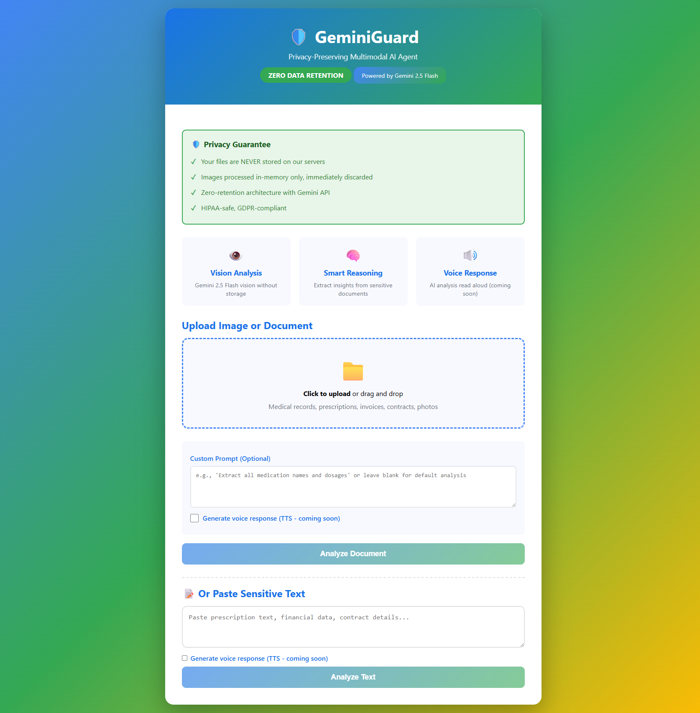
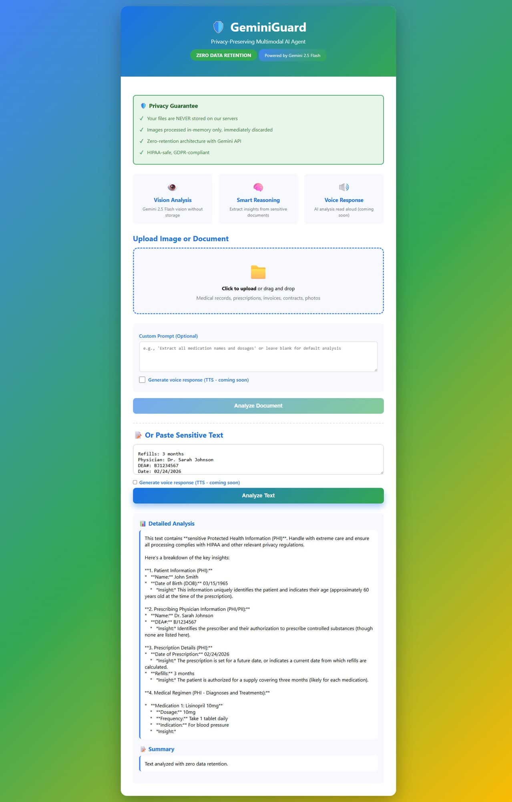

# 🛡️ GeminiGuard

**Privacy-Preserving Multimodal AI Agent powered by Google Gemini 2.0 Flash**

Built for the **Gemini Live Challenge 2026** ($80,000 prize pool) - Submission Deadline: March 16, 2026

---

## 🎯 Mission

GeminiGuard provides **zero-retention AI analysis** for sensitive documents using Google's Gemini 2.0 Flash multimodal model. Perfect for medical records, financial documents, legal contracts, and personal data - without compromising privacy.

## 🚀 Key Features

- **🔐 Zero Data Retention**: Images processed in-memory only, never stored on disk
- **👁️ Vision Analysis**: Gemini 2.0 Flash vision model for document understanding
- **🧠 Smart Reasoning**: Extract insights from sensitive text and images
- **🔊 Voice Response**: TTS integration (coming soon with Google Cloud TTS)
- **🛡️ Privacy-First**: HIPAA-safe, GDPR-compliant architecture
- **⚡ Fast**: Gemini 2.0 Flash for low-latency responses

## 🏗️ Architecture

```
User Upload → In-Memory Buffer → Gemini 2.0 Flash API → Response → Buffer Discarded
                                        ↓
                              (NEVER stored on disk)
```

**Privacy guarantees:**
- `multer.memoryStorage()` - no disk writes
- No file persistence in any stage
- No logs containing sensitive data
- Ephemeral processing only

## 📋 Use Cases

1. **Medical Records**: Extract medication names, dosages, instructions from prescriptions
2. **Financial Documents**: Analyze invoices, receipts, bank statements
3. **Legal Contracts**: Extract key terms, dates, obligations
4. **Personal Data**: Analyze any sensitive document without cloud storage

## 🛠️ Tech Stack

- **Backend**: Node.js + Express
- **AI**: Google Gemini 2.0 Flash (OpenAI-compatible API)
- **File Handling**: Multer (memory-only mode)
- **Privacy**: Zero-retention architecture

## 🌐 Live Demo

**Try it now: [http://104.248.245.44:3001](http://104.248.245.44:3001)**

### Screenshots

**Landing Page:**


**Analysis Results:**


## 🚀 Quick Start

### Prerequisites

- Node.js 18+
- Google Gemini API key ([get one here](https://aistudio.google.com/apikey))

### Installation

```bash
# Clone the repo
git clone <your-repo-url>
cd geminiguard

# Install dependencies
npm install

# Configure your API key
cp .env.example .env
# Edit .env and add your GEMINI_API_KEY

# Start the server
npm start
```

Visit `http://localhost:3000` to use the app.

## 📁 Project Structure

```
geminiguard/
├── server.js           # Main Express server with Gemini integration
├── public/
│   └── index.html      # Frontend UI (drag-and-drop, results display)
├── package.json        # Dependencies
├── .env               # API keys (not committed)
└── README.md          # This file
```

## 🔑 API Endpoints

### POST `/api/analyze`
Analyze an uploaded image/document.

**Request:**
- `file`: Image file (multipart/form-data)
- `prompt`: Optional custom analysis prompt
- `returnVoice`: `true` for TTS response (pending)

**Response:**
```json
{
  "analysis": "Detailed analysis from Gemini...",
  "summary": "Concise 2-3 sentence summary...",
  "privacy": {
    "dataRetention": "zero",
    "storageDuration": "ephemeral",
    "compliance": ["HIPAA-safe", "GDPR-compliant"]
  }
}
```

### POST `/api/analyze-text`
Analyze pasted text without file upload.

**Request:**
```json
{
  "text": "Your sensitive text...",
  "prompt": "Optional analysis instruction",
  "returnVoice": "true"
}
```

### GET `/api/health`
Health check endpoint.

### GET `/api/models`
List available Gemini models and capabilities.

## 🔒 Privacy Technical Details

1. **No Disk Writes**: `multer.memoryStorage()` keeps files in RAM only
2. **Ephemeral Buffers**: `req.file.buffer` garbage collected after response
3. **No Logging**: Sensitive data never written to logs
4. **Gemini API**: Uses Google's privacy-focused API endpoint
5. **Zero Persistence**: No database, no file system storage

## 🎨 Customization

### Change Gemini Model

Edit `server.js`:
```javascript
const models = {
  vision: 'gemini-2.5-flash',
  chat: 'gemini-2.5-flash',
  tts: 'tts-1'
};
```

### Add Custom Prompts

Modify the default prompt in `POST /api/analyze`:
```javascript
text: 'Your custom analysis instructions...'
```

## 🏆 Gemini Live Challenge Submission

This project is built for the **Gemini Live Challenge 2026**:

- **Challenge Focus**: Privacy-preserving multimodal AI
- **Key Differentiator**: Zero-retention architecture for sensitive data
- **Gemini Feature**: Vision + reasoning capabilities of Gemini 2.0 Flash
- **Impact**: Enable AI analysis of medical/financial data without privacy risks

See [DEVPOST_SUBMISSION.md](./DEVPOST_SUBMISSION.md) for full submission details.

## 🛣️ Roadmap

- [ ] Google Cloud TTS integration for voice responses
- [ ] Multi-language support
- [ ] PDF document parsing
- [ ] OCR for scanned documents
- [ ] Real-time streaming responses
- [ ] Mobile app (React Native)

## 📜 License

MIT License - see [LICENSE](./LICENSE)

## 👤 Author

**Alex Tolmach** (decentrathai)  
Built for Gemini Live Challenge 2026

---

## 🙏 Acknowledgments

- Google Gemini team for the Gemini 2.0 Flash API
- OpenAI SDK for API compatibility layer
- Express.js and Multer for robust file handling

**Built with privacy, powered by Gemini.** 🛡️
